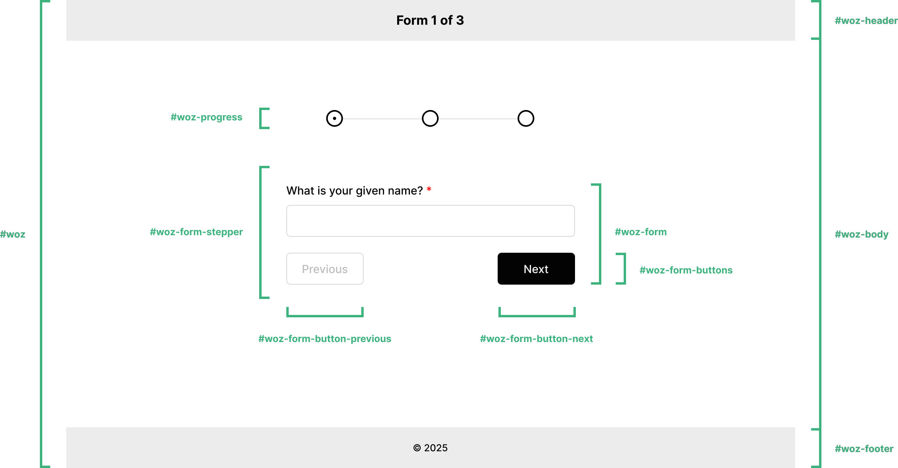

# Layout

Wizard of Zod contains two layouts out of the box - `default` and `basic`. 

The `default` layout includes header and footer slots whereas the `basic` layout does not.

## Default Layout

My rationale for creating the `default` layout was to offer a header slot and a footer slot for those who require them.

### Template

The following markup illustrates container wrappers `default` layout which can be styled with the [classes](../api/props.html#classes) prop.

```html [default]
<div id="woz">
    <div id="woz-header"></div>
    <div id="woz-body">
        <div id="woz-form-stepper">
            <form id="woz-form">
                <!-- YOUR FORM SCHEMA IS RENDERED HERE -->
                <div id="woz-form-buttons">
                    <button id="woz-form-button-previous"></button>
                    <button id="woz-form-button-next"></button>
                </div>
            </form>
        </div>
        <div id="woz-progress"></div> <!-- OPTIONAL -->
    </div>
    <div id="woz-footer"></div>
</div>
```

### Screenshot

As you can see, the `default` layout includes a header slot and a footer slot for your convenience.

<picture>
  <source srcset="../../assets/images/layout-default-dark.png" media="(prefers-color-scheme: dark)">
  
</picture>

## Basic Layout

The basic layout is the Ryanair of layouts... no frills!

### Template

```html [basic]
<div id="woz">
    <div id="woz-body">
        <div id="woz-form-stepper">
            <form id="woz-form">
                <!-- YOUR FORM SCHEMA IS RENDERED HERE -->
                <div id="woz-form-buttons">
                    <button id="woz-form-button-previous"></button>
                    <button id="woz-form-button-next"></button>
                </div>
            </form>
        </div>
        <div id="woz-progress"></div> <!-- OPTIONAL -->
    </div>
</div>
```

### Screenshot

## Other Layouts

I plan on adding further layout ideas in the near future. I will also consider any layout ideas that you may have. Please [let me know](https://github.com/FullStackSimon/wizard-of-zod/discussions)!